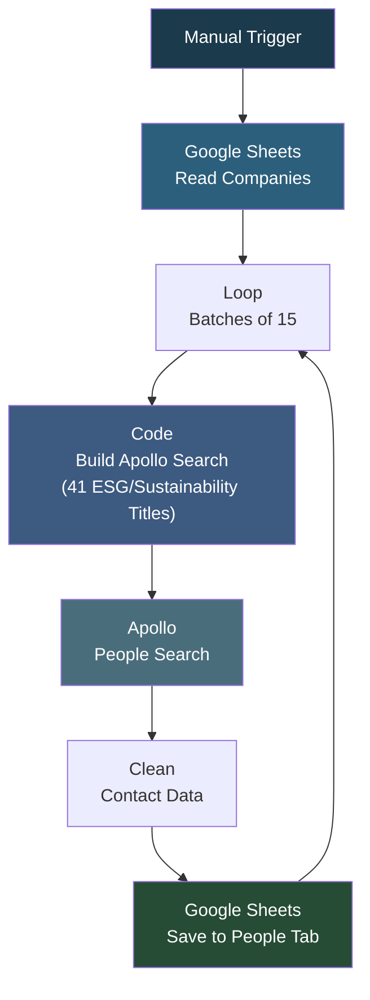

# People Extraction Flow

## Overview

A sustainability and ESG leadership contact extraction pipeline. It reads company data from a Google Sheet (Carbon Unbound project), extracts company website domains, builds Apollo people search queries targeting sustainability/ESG/climate/carbon leadership titles (CSO, VP Sustainability, Head of ESG, Director of Climate, etc.) across US and European locations, and saves the extracted contacts to a separate "people" tab. The workflow processes companies in batches of 15 with delays to manage API rate limits.

## How It Works

```
Manual Trigger -> Google Sheets (read companies) -> Loop in batches of 15 -> Build Apollo search body (41 sustainability titles + company domains + US/Europe filter) -> Apollo People Search -> Extract people data -> Clean contacts (name, title, LinkedIn, company, website) -> Save to Google Sheet (people tab)
```

### Workflow Diagram



## Integrations

- **Google Sheets** - Company data source and contact output
- **Apollo** - People search targeting sustainability/ESG leadership

## Setup

1. Import `people_extarction_flow.json` into your n8n instance.
2. Configure Google Sheets and Apollo credentials.
3. Update the Google Sheet document ID.
4. Execute manually.
